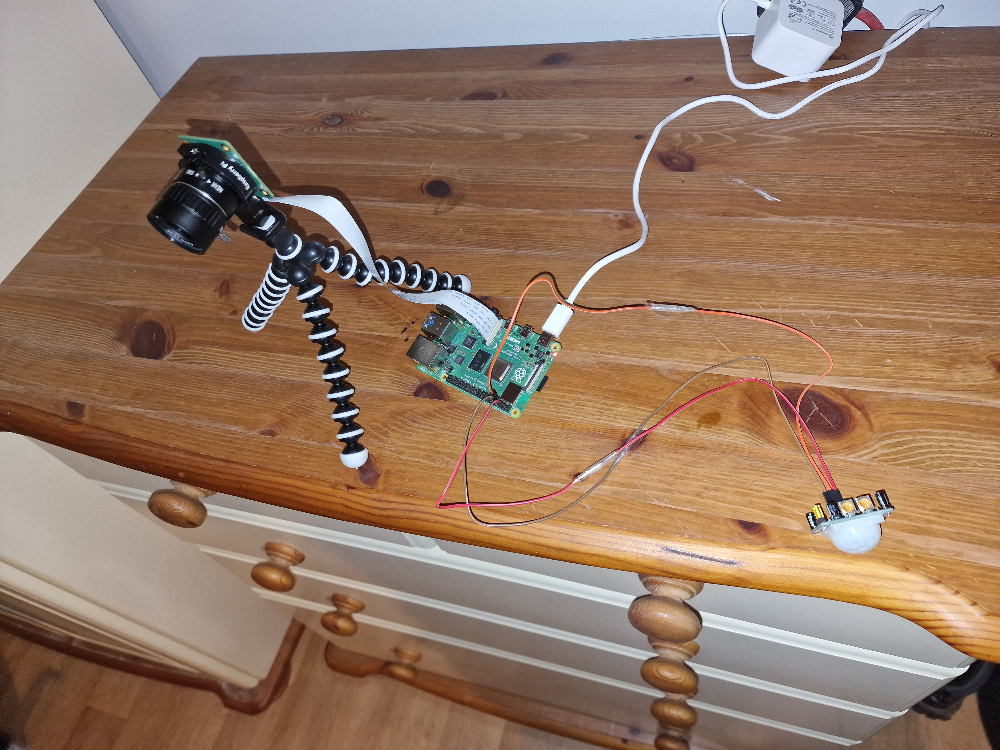
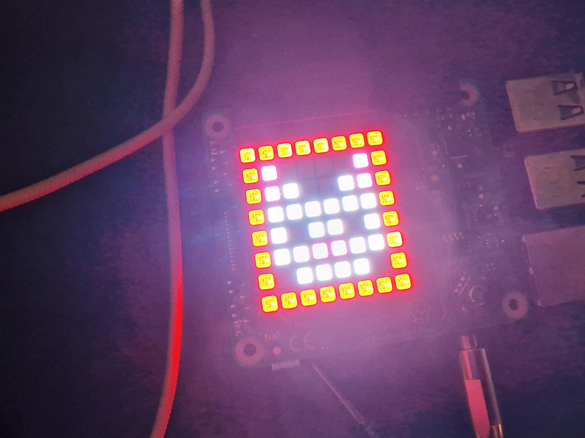

<p align="center">
  
</p>

# Kitten Monitor
#### Student Name: *MariCruz Lopez*  -  Student ID: *20108907*

## Problem
I have recently got 3 kittens and they are wreaking havoc in my house while I am not there.

## Proposed Solution
I am going to create a monitoring/CCTV system using two Raspberry Pi's.

The first will be placed in the laundry room to monitor if the kittens enter the room, using a Camera triggered with a motion sensor.

The second will be kept with me in the spare bedroom where I am studying and will be equipped with a SenseHAT to notify me, by lighting up the SenseHAT LED's and playing an audio notification, if I respond to the the notification locally by acknowledging it via the button on the SenseHAT nothing will occur, if I miss the notification I will be sent an email alert from Thingspeak(as it is assumed I am away from home).

Once I review the events in Thingspeak after the alert I will add an option to sound an alarm in the laundry room if I am away from home to hopefully scare the intruders(kittens) out of the laundry room.

## End Result
There were may challenges faced in the project which caused the end solution to change from the proposed solution.

One was the alarm on the monitor Pi, this is now on the remote Pi as it was not nice to traumatise the kittens.

The other was the intention to use ThinkSpeak email notifications, I tried a few differen approaches for notifications:
 - thinkspeak email notification worked but was too slow(alarm was ringing way before email came).
 - Blynk App, I could not get the live stream and video links to work no matter how hard I tried(I tried a lot) :'-(
 - Flask hosted template, with Glitch media hosting, was too slow to upload media
 - Flask hosted template with local file storage, this is not fancy but works perfectly.

One thing that stayed the same was the proposed use of MQTT to trigger the alarm, this worked perfectly.

## Tools, Technologies and Equipment

I aim to use a combination of MQTT and ThingSpeak to achieve this by using them to notify me via email or phone notification(via an MQTT client app) if motion has been detected in the laundry room and allow me to review pictures taken at the motion detection event and sound an alarm if needed.

I plan to use two Raspberry Pi's, a high definition camera module with tripod, a SenseHAT and a pair of wired audio jack speakers to sound notifications and alarms.

## Project Repository
https://github.com/MCLOPFER/CompSystem-Net_IoT_catMonitoring

## Architecture Overview
There is 3 parts to this overall solution installed accross 2 RasberryPi's.

Rasberry Pi 1(monitor):
1. motion_mqtt_pub.py:
   MQTT client publishing motion events/messages to a "motion" topic from a PIR sensor.
2. camera_api.py:
   Flask app with a camera class instance used for all API interactions with the camera.
   It also hosts the before and after media(pictures/videos) of alarm events.

Rasberry Pi 2(remote):
1. alarm_mqtt_sub.py:
   MQTT client subscribing to the "motion" topic that is used to trigger an alarm. 

## Hardware installation:
### To run this project you will need the following:
- 2 Rasberry Pi's
- PIR sensor
- SenseHat
- Rasberry Pi Camera
- 3 female to female jumper wires

The PIR sensor can be tricky to set up, but I found an excelent guide [here](https://randomnerdtutorials.com/raspberry-pi-detect-motion-pir-python/#:~:text=GND%2C%20and%20Data.-,Wiring%20a%20PIR%20Motion%20Sensor%20to%20the%20Raspberry%20Pi,at%20the%20Raspberry%20Pi%20pinout).)  

My Monitor Pi setup:
<p align="left">
  
</p>


My Remote Pi setup is just a Pi with a sensehat attached:
<p align="left">
  
</p>

## Software Installation
To install this project you will need to clone this repository on two seperate Rasberry Pi's

Once you have the repo cloned on both Rasberry PI's you can install the required pip packages with the following commands:
#### monitor Pi:
  ``` shell
  pip install -r /path/to/repo/monitor/requirements.txt
  ```
#### remote Pi:
  ``` shell
  pip install -r /path/to/repo/remote/requirements.txt
  ```

## Once all the dependancies have been installed, you can know start the processes:
  #### monitor Pi:
  ``` shell
  ssh user@[monitor Pi IP]
  cd /path/to/repo/monitor
  ./motion_mqtt_pub.py
  
  ssh user@[monitor Pi IP]
  cd /path/to/repo/monitor
  ./camera_api.py
  ```

  #### remote Pi:
  ``` shell
  ssh user@[remote Pi IP]
  cd /path/to/repo/remote
  ./alarm_mqtt_sub.py
  ```
